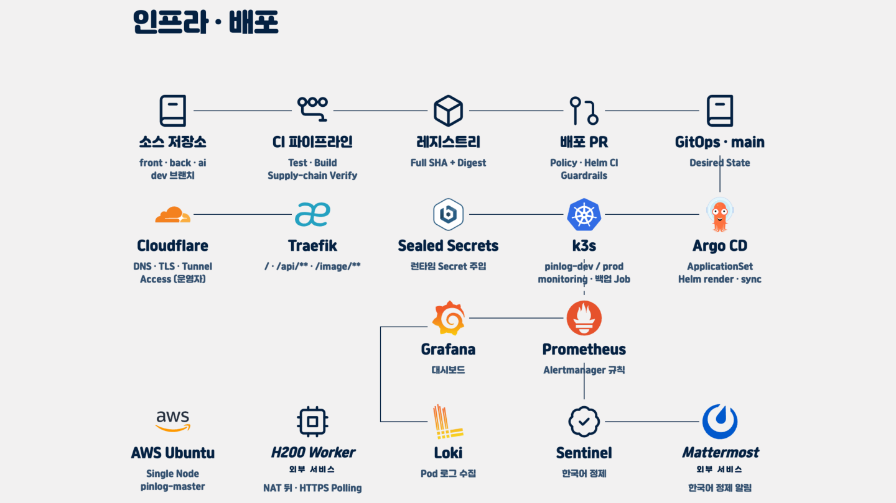

# PinLog Infra

PinLog 서비스를 한 대의 AWS Ubuntu 서버에 안전하게 배포하고 운영하기 위한
**Kubernetes·GitOps 저장소**입니다. 애플리케이션 소스가 아니라 k3s 부트스트랩,
Argo CD 애플리케이션, 공용 Helm 차트, 환경별 배포값, 플랫폼 구성과 운영 문서를
관리합니다.

> 서버는 이미 제공된 자원이고 팀에는 클라우드 API 권한이 없습니다. 따라서 이
> 저장소는 Terraform으로 서버를 만드는 대신, **서버 위의 배포 상태**를 코드로
> 관리합니다.

## 아키텍처 한눈에 보기



그림의 위쪽은 코드가 배포 상태가 되는 과정이고, 아래쪽은 사용자의 요청과 운영
신호가 흐르는 과정입니다.

1. Frontend·Backend·AI 저장소의 CI가 테스트와 빌드를 통과한 이미지를 private
   GHCR에 게시합니다.
2. 배포 자동화는 source commit의 **full SHA와 image digest**를 함께 검증하고,
   `infra`의 기능 브랜치에서 해당 값만 바꾸는 PR을 만듭니다.
3. 정책 검사와 Helm render가 성공해 PR이 병합되면 `main`이 desired state가 됩니다.
4. Argo CD가 `main`을 읽어 ApplicationSet과 Helm으로 k3s를 동기화합니다.
5. 외부 요청은 용도에 따라 Cloudflare DNS·TLS·Tunnel을 지나고, 클러스터 안에서는
   Traefik이 `/`, `/api/**`, `/image/**` 같은 경로를 서비스로 전달합니다.
6. Prometheus와 Loki가 메트릭·로그를 모으고 Grafana에서 보여 줍니다. Alertmanager는
   경보를 Sentinel로 보내며, Sentinel은 안전한 한국어 알림으로 정리해 Mattermost에
   전달합니다.

### Desired state와 live 상태

둘은 같은 말이 아닙니다.

| 구분 | 의미 | 확인 방법 |
|---|---|---|
| **Desired state** | 이 저장소 `main`에 선언된, Argo CD가 만들려고 하는 상태 | Git의 `apps/`, `platform/`, `argocd/`, `secrets/` 확인 |
| **Live state** | 지금 클러스터에서 실제로 실행 중인 상태 | Argo CD의 revision·Sync·Health와 Kubernetes readiness 확인 |

이 README의 구성 설명은 기준 커밋 `6fc17bff5c70fe2eeb301f5652f49e6700487510`의
**저장소 선언과 문서**를 근거로 합니다. 저장소만 보고 파드가 실제로 Ready인지,
Cloudflare Tunnel이 연결됐는지, 외부 worker가 실행 중인지 단정하지 않습니다.
운영 확인은 [운영 런북](docs/runbook.md)의 읽기 전용 점검 절차를 따릅니다.

## 핵심 구성

### 단일 k3s 노드

- `pinlog-master` 한 대가 control plane과 workload를 함께 실행합니다.
- **K3s embedded containerd**, Traefik과 ServiceLB를 사용합니다.
- 한 노드와 한 디스크에 장애가 집중되므로 다중 노드 HA는 제공하지 않습니다.
- `pinlog-prod`에는 ResourceQuota와 LimitRange를 두고, `pinlog-dev`는 더 작은 예산으로
  운영 서비스 자원을 침범하지 않게 합니다.

### Argo CD GitOps

- `argocd/root/root-app.yaml`이 App-of-Apps 진입점입니다.
- `apps/prod/*`와 `apps/dev/*`의 디렉터리를 ApplicationSet이 자동 발견합니다.
- 모든 서비스는 `charts/microservice` 공용 Helm 차트를 사용합니다.
- prod는 자동 sync·prune·self-heal을 사용합니다. dev는 작업 중 수동 scale을 허용하기
  위해 self-heal을 끕니다.
- 서버에서 `kubectl apply`로 원하는 상태를 고정하지 않습니다. 변경과 rollback은
  기능 브랜치, PR, 필수 CI와 Git revert로 기록합니다.

### 불변 이미지 승격

- 서비스 이미지는 사람이 다시 가리킬 수 있는 `latest` 대신 **source SHA +
  `sha256` digest**로 고정합니다.
- Backend·Frontend·AI updater는 source workflow, provenance 또는 publish evidence,
  GHCR manifest digest와 Infra PR의 exact head를 검증합니다.
- 자동화도 `main`에 직접 push하지 않고 배포 PR을 거칩니다.
- Backend 승격은 `backend-image-update`가 검증된 PR을 만들고,
  `backend-image-auto-merge`가 required checks와 exact head를 다시 확인합니다.
- 이 경로의 `PINLOG_IMAGE_UPDATER_TOKEN`은 저장소별 최소 권한으로 분리하며,
  credential·source CI·digest 검증이 하나라도 없으면 fail-closed합니다.
- 검증된 updater가 없는 서비스는 같은 형식의 기능 브랜치와 PR로 수동 승격합니다.
- private GHCR의 CI 접근 자격과 클러스터 pull 자격은 분리하며 값은 저장소나 로그에
  남기지 않습니다.

자세한 공급망·브랜치 정책은 [Git/CI 거버넌스](docs/git-governance.md)를 봅니다.

### Cloudflare와 Traefik

- Cloudflare는 공개 도메인의 DNS·TLS와 승인된 Tunnel 진입점을 담당합니다.
- Traefik은 k3s 안의 Ingress Controller로서 Frontend, Backend API와 image 경로를
  namespace 안의 Service로 전달합니다.
- Argo CD와 Kubernetes API는 공개 서비스 경로로 노출하지 않습니다.
- Cloudflare connector와 Traefik route는 서로 다른 계층입니다. Tunnel이 연결돼도
  Ingress·Service·readiness가 실패하면 사용자 요청은 성공하지 않습니다.

### Sealed Secrets

이 저장소에는 평문 비밀번호·토큰·API 키를 저장하지 않습니다. 공개 저장소에는
클러스터의 Sealed Secrets controller만 풀 수 있는 암호문을 두고, 런타임 Secret은
클러스터 안에서 생성합니다. controller 개인키를 잃으면 재구축 시 기존 암호문을
복구할 수 없으므로 별도 안전한 백업이 필수입니다.

생성·교체·백업 절차는 [시크릿 관리](secrets/README.md)를 따릅니다.

## 환경별 역할

| 영역 | 저장소가 선언하는 역할 | 주의할 점 |
|---|---|---|
| `pinlog-dev` | Frontend·AI·협업 도구 등 개발 검증 | 작은 단일 노드이므로 필요한 workload만 실행 |
| `pinlog-prod` | Backend, image 서비스, PostgreSQL·pgvector, Redis, DB backup | 사용자 요청과 영속 데이터가 있는 운영 영역 |
| `monitoring` | Prometheus, Alertmanager, Grafana, Loki, Alloy | 서비스 생존을 우선하는 용량 가드레일 적용 |

Backend는 PostgreSQL 16 + pgvector에 연결하고 Flyway가 schema 변경 순서를 소유합니다.
Redis는 캐시 용도라 영속성을 두지 않습니다. AI dev는 Backend Flyway 완료 뒤 bootstrap과
Deployment가 진행되는 계약입니다. 자세한 경계는
[PostgreSQL pgvector 전환](docs/postgres-pgvector-migration.md)과
[AI dev Infra 선행조건](docs/ai-dev-prerequisites.md)에 있습니다.

## 관측과 알림

```text
메트릭: 서비스·노드 → Prometheus → Grafana
로그:   Pod → Alloy → Loki → Grafana
경보:   Prometheus → Alertmanager → Sentinel → Mattermost
외부 가용성: GitHub-hosted probe → Mattermost
```

- **Prometheus**는 서비스와 노드 메트릭을 수집하고 rule을 평가합니다.
- **Loki**는 Alloy가 수집한 Pod 로그를 짧게 보관합니다.
- **Grafana**는 Prometheus·Loki·Alertmanager를 한 화면에서 조회합니다.
- **Alertmanager**는 severity에 따라 경보를 묶고 반복·해소 알림을 제어합니다.
- **Sentinel Receiver**는 호스트 systemd 서비스입니다. 입력을 제한·정제하고 실패 시
  결정적인 fallback을 사용한 뒤 Mattermost에 한국어 운영 알림을 보냅니다.
- 노드 전체가 꺼지면 내부 경보 경로도 함께 멈추므로, GitHub-hosted 외부 probe가
  공개 HTTPS/TLS를 별도로 확인합니다.

저장소는 이 구성을 desired state로 선언하지만, 현재 수집 성공 여부와 알림 도착 여부는
live 검증 대상입니다. [모니터링](docs/monitoring.md)과
[운영 알림](docs/alerting.md)의 단계별 검증을 따릅니다.

## Backup과 복구 경계

- PostgreSQL CronJob은 매일 custom-format dump를 만들고 archive를 검사한 뒤 원자적으로
  `latest.dump`를 갱신합니다.
- dump는 10Gi `local-path-retain` PVC에 저장되며 검증된 파일을 7일 보관합니다.
- DB와 backup PVC가 **같은 노드의 같은 디스크**에 있으므로 이 백업만으로 서버 유실을
  복구할 수 없습니다.
- 주 1회 이상 서버 밖으로 복사하고, 실제 restore를 검증해야 합니다.

실행·복원·rollback은 [운영 런북](docs/runbook.md)과
[PostgreSQL pgvector 전환](docs/postgres-pgvector-migration.md)을 기준으로 합니다.

## H200 image worker

아키텍처의 H200 worker는 k3s 노드 밖에 있는 외부 GPU 서비스입니다. 외부에서 클러스터로
인바운드 연결을 여는 대신, worker가 NAT egress를 통해 image API를 **HTTPS polling**하고
작업을 가져가는 구조입니다. 저장소는 k3s 쪽 image 서비스, `/image` route, 영속 볼륨과
암호화된 worker 인증 입력 계약을 관리합니다.

H200 머신의 설치·프로세스·GPU scheduling은 이 저장소 관리 범위가 아닙니다. 따라서
그림은 설계 경계를 나타내며, worker가 현재 실행 중이거나 polling에 성공한다고 뜻하지
않습니다. live 확인에서는 image API health, 대기 작업의 stale 시간, 인증 실패와 worker
측 로그를 함께 확인해야 합니다.

## 저장소 구조

```text
infra/
├── bootstrap/           k3s·Sealed Secrets·Argo CD 최초 설치와 호스트 설정
├── argocd/              root app, AppProject, Application, ApplicationSet
├── charts/microservice/ 서비스 공용 Helm 차트
├── apps/{dev,prod}/     환경·서비스별 Helm values
├── platform/            DB, cache, ingress, monitoring, network policy
├── secrets/             ciphertext-only SealedSecret
├── ops/                 호스트 운영 서비스와 hardening 도구
├── tools/               CI 검증·image update 도구
├── tests/               저장소 정책과 rendered manifest 계약 테스트
└── docs/                설계, 운영, 장애 대응 문서
```

## 처음 설치할 때

호스트 사전 조건을 확인한 뒤 `bootstrap/`의 번호 순서대로 실행합니다.

```bash
sudo ./bootstrap/00-preflight.sh
sudo ./bootstrap/01-install-k3s.sh
sudo ./bootstrap/sync-tls-secret.sh
sudo ./bootstrap/02-install-sealed-secrets.sh
sudo ./bootstrap/03-install-argocd.sh
sudo ./bootstrap/04-bootstrap-root-app.sh
```

`00-preflight.sh`는 k3s보다 먼저 실행해야 합니다. host firewall의 routed deny 상태에서
CNI forwarding이 열리지 않으면 Pod가 Running이어도 DNS와 네트워크가 실패할 수 있습니다.

설치 직후에는 Sealed Secrets controller 개인키의 외부 백업, Argo CD 초기 관리자
credential 교체, PostgreSQL runtime credential 준비를 완료합니다. 실제 값이나 복호화
출력은 터미널 기록·PR·CI 로그에 남기지 않습니다.

## 문서 안내

### 먼저 읽기

| 문서 | 내용 |
|---|---|
| [온보딩](docs/onboarding.md) | 팀원이 처음 보는 전체 흐름과 역할별 시작점 |
| [아키텍처](docs/architecture.md) | 상세 구조, 설계 결정과 제약 |
| [운영 런북](docs/runbook.md) | 장애 대응, 배포·DB·백업 점검 |
| [새 서비스 추가](examples/README.md) | 공용 차트로 서비스를 등록하는 절차 |
| [Backend 규약](docs/backend-conventions.md) | context path, health, container 계약 |

### 운영·보안

| 문서 | 내용 |
|---|---|
| [모니터링](docs/monitoring.md) | Prometheus·Loki·Grafana 운영과 용량 gate |
| [운영 알림](docs/alerting.md) | Alertmanager·Sentinel·Mattermost·외부 probe |
| [시크릿 관리](secrets/README.md) | SealedSecret 생성·교체와 controller key 백업 |
| [Git/CI 거버넌스](docs/git-governance.md) | PR, 필수 CI, 공급망 검증, rollback |
| [NetworkPolicy](docs/network-policies.md) | namespace 통신 허용 계약 |
| [Pod Security Admission](docs/pod-security-admission.md) | restricted audit/warn과 전환 조건 |
| [컨테이너 runtime](docs/container-runtime.md) | k3s embedded containerd 운영 |
| [용량 hardening](docs/capacity-hardening.md) | 단일 노드 resource 가드레일 |
| [metrics-server](docs/metrics-server.md) | 저용량 프로필의 tuning과 rollback |
| [Argo CD 안전 접속](docs/argocd-access-runbook.md) | 공개 노출 없는 관리 접속 절차 |

### 데이터·AI

| 문서 | 내용 |
|---|---|
| [PostgreSQL pgvector 전환](docs/postgres-pgvector-migration.md) | backup·migration·검증·rollback |
| [AI dev Infra 선행조건](docs/ai-dev-prerequisites.md) | Flyway·DB·runtime secret·bootstrap gate |
| [AI shared DB 복구](docs/ai-shared-database-recovery.md) | shared database 장애 복구 |
| [AI serving](docs/ai-serving.md) | dev AI workload와 prod 전 검증 계약 |

## 변경 원칙

1. 기능 브랜치와 PR을 사용하고 `main`에 직접 push하지 않습니다.
2. 앱 코드는 각 서비스 저장소에서 변경합니다. 이 저장소에는 배포 계약만 둡니다.
3. live 수정보다 Git desired state 변경을 우선하며, 예외 작업은 런북과 승인 경계를
   따릅니다.
4. image는 full SHA와 digest로 고정하고 mutable tag를 사용하지 않습니다.
5. 평문 Secret, token, 운영 IP, 개인정보를 문서·manifest·로그에 기록하지 않습니다.
6. 배포 완료는 merge가 아니라 Argo CD revision, Sync/Health, rollout, readiness와 외부
   응답까지 확인한 뒤 판단합니다.