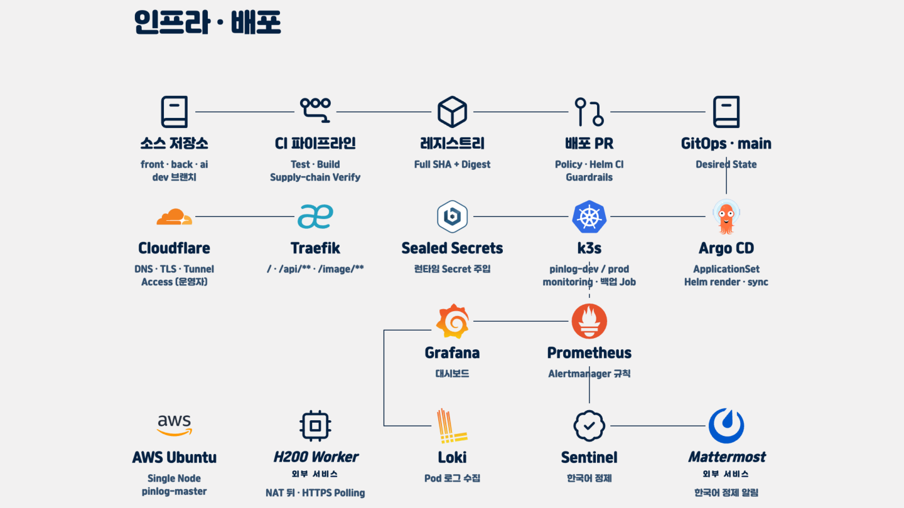
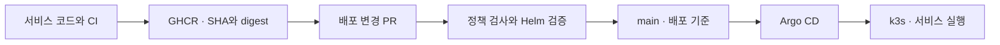
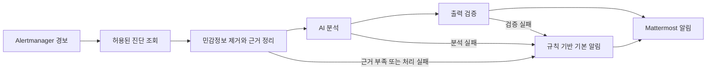

# PinLog Infra

> 한 대의 서버에서 팀의 서비스를 배포하고 운영하기 위한 인프라.
> GitOps 배포, 관측, AI 운영 알림과 데이터 복구를 함께 설계했습니다.

[PinLog 프로젝트](https://github.com/Team-PinLog/PinLog) · [상세 아키텍처](docs/architecture.md) · [운영 기록과 절차](docs/runbook.md)

## 1. 프로젝트 소개

PinLog는 장소의 맥락을 기록하고, AI 자연어 검색과 익명 컬렉션으로 다시 발견하는 장소 아카이빙 플랫폼입니다. 이 저장소는 Frontend·Backend·AI 등 팀이 개발하는 서비스를 배포하고 운영하는 기반을 관리합니다.

출발점은 **이미 제공된 AWS Ubuntu 서버 한 대와 제한된 자원**이었습니다. 팀에는 클라우드 API 권한이 없어 서버를 새로 프로비저닝하는 대신, 주어진 서버 위에서 배포를 반복하고 문제를 확인하며 복구할 수 있는 구조를 만드는 데 집중했습니다.

| 설계 과제 | 접근 방식 |
| --- | --- |
| 여러 서비스의 배포 방식 통일 | 공용 Helm 차트와 환경별 설정 |
| 배포 이력과 실행 이미지 추적 | GitOps PR, source commit SHA와 image digest 검증 |
| 단일 서버의 자원 경쟁 | 개발·운영 영역 분리와 자원 상한 설정 |
| 운영 문제의 발견과 전달 | 메트릭·로그 수집, AI 분석을 활용한 한국어 알림 |
| 장애 이후의 복구 | DB 백업 검증, Git revert와 복구 절차 문서화 |

<!-- 보완: 개발 기간, 본인의 인프라 담당 범위, 개발 과정에서 AI를 활용한 구체적인 사례 -->

## 2. 프로젝트 화면

<!-- 추가 화면 후보: Argo CD 배포 상태, Grafana 운영 대시보드, 민감정보를 가린 Sentinel 알림 -->

## 3. 시스템 아키텍처

### 코드가 배포되기까지

서비스 저장소의 CI가 테스트와 빌드를 거쳐 이미지를 private GHCR에 게시합니다. 배포 자동화는 원본 커밋과 이미지의 출처를 검증하고, 인프라 저장소에 이미지 변경 PR을 만듭니다. 정책 검사와 Helm 검증을 통과해 병합된 설정을 Argo CD가 k3s에 반영합니다.

```mermaid
flowchart LR
    SRC[서비스 코드와 CI] --> IMG[GHCR · SHA와 digest]
    IMG --> PR[배포 변경 PR]
    PR --> CHECK[정책 검사와 Helm 검증]
    CHECK --> MAIN[main · 배포 기준]
    MAIN --> ARGO[Argo CD]
    ARGO --> K3S[k3s · 서비스 실행]
```

### 요청과 운영 신호의 흐름

외부 요청은 용도에 따라 Cloudflare의 DNS·TLS·Tunnel을 지나고, Traefik이 서비스별 경로로 전달합니다. Prometheus와 Loki는 메트릭과 로그를 수집하고, Grafana는 이를 조회하는 화면을 제공합니다. 경보는 Alertmanager에서 Sentinel을 거쳐 Mattermost로 전달합니다.

이미지 생성을 담당하는 H200 worker는 클러스터 밖에 있습니다. worker가 image API를 HTTPS polling해 작업을 가져가는 구조로, 외부 GPU 서버의 설치와 프로세스 관리는 이 저장소의 범위에 포함하지 않습니다.

| 영역 | 기술과 역할 |
| --- | --- |
| 실행 환경 | AWS Ubuntu 단일 서버 · k3s · K3s embedded containerd |
| 배포 | GitHub Actions · private GHCR · Helm · Argo CD ApplicationSet |
| 요청 처리 | Cloudflare · Traefik |
| 데이터 | PostgreSQL 16 · pgvector · Redis |
| 관측 | Prometheus · Grafana · Loki · Alloy · Alertmanager |
| AI 운영 알림 | Sentinel Receiver · AI API · Mattermost |
| 보안 | Sealed Secrets · NetworkPolicy · 최소 권한 자격 증명 |

이 문서는 저장소에 선언된 구성과 운영 기록을 설명합니다. 현재 서비스의 정상 동작 여부는 Argo CD의 revision·Sync·Health, Kubernetes readiness, 외부 응답으로 별도 확인합니다.

## 4. AI를 활용한 운영 알림

### 경보를 판단에 필요한 정보로 정리합니다

Sentinel은 경보와 관련된 메트릭·로그를 제한된 범위에서 조회하고, 정제한 근거를 바탕으로 한국어 운영 알림을 구성합니다. AI 분석 경로에서는 원시 로그와 경보 전체를 넘기지 않고, 허용된 필드와 크기로 제한한 JSON만 전달합니다.

```mermaid
flowchart LR
    A[Alertmanager 경보] --> B[허용된 진단 조회]
    B --> C[민감정보 제거와 근거 정리]
    C --> D[AI 분석]
    D --> E[출력 검증]
    E --> F[Mattermost 알림]
    C -->|근거 부족 또는 처리 실패| G[규칙 기반 기본 알림]
    D -->|분석 실패| G
    E -->|검증 실패| G
    G --> F
```

위 그림은 AI 분석을 사용하는 경로를 요약합니다. 실제로는 모델 미호출, shadow 평가, direct AI API, 기존 경로로의 롤백 모드를 구분합니다.

### AI가 실패해도 알림은 이어집니다

AI API의 지연이나 오류, 출력 형식 위반이 발생하면 규칙 기반 기본 알림을 사용합니다. 해소된 경보는 AI 호출 없이 처리하고, 호출 예산과 동시 처리량을 제한합니다. AI 분석 결과로 클러스터를 자동 변경하지 않으며, Receiver는 Kubernetes API 권한 없이 실행합니다.

**AI에는 근거를 해석하는 역할을 맡기고, 입력 범위와 전달 규칙은 코드로 통제합니다.** 분석 품질과 알림 전달의 신뢰성을 각각 다루기 위한 설계입니다.

[Sentinel 구현과 검증](ops/sentinel-receiver/README.md) · [운영 알림](docs/alerting.md)

## 5. 개발 철학과 설계 결정

### 주어진 제약에서 운영 가능한 구조를 선택합니다

서버 한 대에 control plane과 workload를 함께 배치하고, 공용 차트로 서비스 배포 방식을 통일했습니다. 개발 환경에는 더 작은 자원 예산을 두고, 모니터링에도 용량 제한을 적용합니다.

구성은 단순해지지만 서버와 디스크에 장애가 집중됩니다. 개발·운영 namespace를 나누어도 물리적 장애가 격리되는 것은 아니므로, 이 구조를 다중 노드 고가용성으로 설명하지 않습니다.

[용량 설계와 자원 제약](docs/capacity-hardening.md)

### 자동화가 변경하는 대상도 검증합니다

배포 이미지는 full commit SHA와 digest로 고정합니다. 자동화는 서비스 CI의 성공 여부, 게시 근거와 레지스트리 digest를 확인하고, 병합 직전에도 검사한 PR 커밋과 현재 커밋이 같은지 확인합니다. 필요한 검증이 빠지면 변경을 중단합니다.

이 방식은 단순한 태그 갱신보다 복잡하지만, 어떤 코드에서 만들어진 이미지가 배포되는지 추적할 수 있습니다. 사람과 AI 모두 기능 브랜치와 PR을 사용하며 `main`에 직접 push하지 않습니다. 롤백 역시 Git revert로 기록합니다.

[Git/CI 거버넌스](docs/git-governance.md)

Backend의 `backend-image-update`는 검증한 이미지의 배포 PR을 만들고, `backend-image-auto-merge`는 필수 검사와 병합할 커밋을 다시 확인합니다. `PINLOG_IMAGE_UPDATER_TOKEN`은 이 자동화에 필요한 저장소별 최소 권한으로 관리하며, 클러스터의 이미지 다운로드 자격과 분리합니다.

### 배포 선언과 실제 동작을 구분합니다

Git의 설정은 실행하려는 상태이고, 클러스터의 상태는 실제 결과입니다. PR 병합이나 Argo CD 동기화만으로 배포 완료를 판단하지 않고, readiness와 외부 응답까지 확인하는 절차를 둡니다.

단일 노드 전체가 멈추면 내부 모니터링도 함께 멈춥니다. 이를 보완하기 위해 GitHub-hosted 외부 probe가 공개 HTTPS와 TLS를 확인하고 Mattermost에 직접 알리는 경로를 별도로 둡니다.

[모니터링 구성](docs/monitoring.md) · [운영 런북](docs/runbook.md)

## 6. 운영 과정에서의 개선

### 컨테이너 런타임의 불필요한 연결 계층 제거

운영 기록에서는 Docker와 cri-dockerd를 사용하는 경로에서 Kubelet의 반복 조회가 런타임 CPU를 지속적으로 점유하는 문제가 확인됐습니다. K3s embedded containerd로 전환해 해당 연결 계층을 제거했습니다.

전환 절차에는 PostgreSQL 백업, 기존 설정 보존, 실행 중인 컨테이너 확인과 롤백 경로를 포함했습니다. 런타임 교체뿐 아니라 기존 데이터와 workload를 보존하면서 변경하는 과정을 함께 다뤘습니다.

[컨테이너 runtime](docs/container-runtime.md)

### 백업 파일 생성과 복구 가능성을 구분

PostgreSQL 백업은 dump를 만든 뒤 archive를 검사하고, 검증한 파일만 `latest.dump`로 원자적으로 반영합니다. 불완전한 백업이 최신 복구 지점으로 취급되지 않게 하기 위한 구조입니다.

다만 DB와 백업 PVC가 같은 노드의 같은 디스크에 있어, 이 백업만으로는 서버 유실에 대응할 수 없습니다. 서버 외부 복사와 실제 복원 검증을 별도 운영 절차로 둡니다.

[PostgreSQL pgvector 전환](docs/postgres-pgvector-migration.md)

## 7. 한계와 개선 방향

이 인프라는 제한된 서버에서 배포를 반복하고 운영 문제를 추적할 수 있도록 설계했습니다. 현재 구조에서 계속 확인해야 할 과제는 다음과 같습니다.

- **서버 장애 대응:** 단일 노드 장애에 대비한 외부 백업과 복원 검증.
- **자원 배분:** 서비스와 관측 도구의 사용량을 바탕으로 한 자원 예산 조정.
- **AI 알림 품질:** 실제 운영 근거와 분석 결과를 비교하고, 근거가 부족한 경우 기본 알림이 유지되는지 확인.

<!-- 보완: 직접 수행한 검증 결과와 운영 지표를 근거로 성과 및 다음 과제의 우선순위 작성 -->

## 관련 문서

| 문서 | 내용 |
| --- | --- |
| [온보딩](docs/onboarding.md) | 팀을 위한 구성 설명과 작업 흐름 |
| [아키텍처](docs/architecture.md) | 상세 설계와 제약 |
| [시크릿 관리](secrets/README.md) | 암호화된 설정과 복구 키 관리 |
| [NetworkPolicy](docs/network-policies.md) | 환경별 통신 범위 |
| [Pod Security Admission](docs/pod-security-admission.md) | 컨테이너 보안 정책 |
| [metrics-server](docs/metrics-server.md) | 자원 사용량 조정과 검증 |
| [AI dev Infra 선행조건](docs/ai-dev-prerequisites.md) | DB와 AI 배포 순서 |
| [AI shared DB 복구](docs/ai-shared-database-recovery.md) | 데이터베이스 복구 절차 |
| [AI serving](docs/ai-serving.md) | AI workload 배포 계약 |
