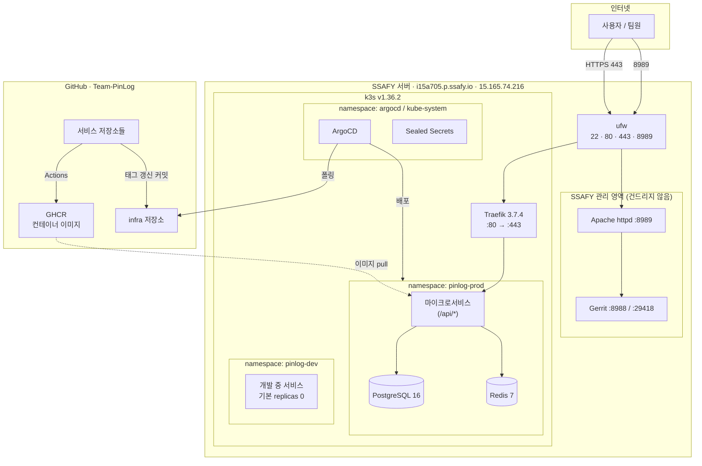
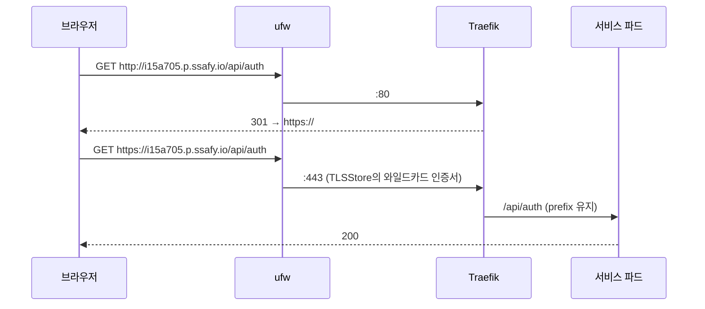

# 아키텍처

PinLog 인프라의 구조와 **왜 그렇게 결정했는지**를 정리한다.
"무엇이 있는가"는 매니페스트를 읽으면 되지만, "왜 이렇게 했는가"는
기록해두지 않으면 유실된다.

**작성 시점**: 2026-07-20 (초기 구축 완료)

---

## 1. 전체 구조



### 서버 현황

| 항목 | 값 |
|---|---|
| 호스트 | `i15a705.p.ssafy.io` → `15.165.74.216` (ap-northeast-2a) |
| 사양 | 4 vCPU / 15Gi RAM / 309G 디스크, **swap 없음** |
| OS | Ubuntu 24.04.3, 커널 6.17, cgroup v2 |
| 소유 | SSAFY AWS 계정 `910333678334` (팀에 API 자격증명 없음) |

### 구성요소 버전

| 구성요소 | 버전 |
|---|---|
| k3s | `v1.36.2+k3s1` |
| Traefik | `3.7.4` (k3s 번들) |
| ArgoCD | `v3.4.5` |
| Sealed Secrets | `0.38.4` |
| PostgreSQL | `postgres:16-alpine` |
| Redis | `redis:7-alpine` |

---

## 2. 설계 결정과 근거

### 2.1 Terraform을 쓰지 않는다

**결정**: 인프라 프로비저닝 도구를 도입하지 않고, 이 저장소는 배포 인프라만 담는다.

**근거**: 서버가 SSAFY AWS 계정에 **이미 프로비저닝되어 배정**된 자원이다.
팀에 AWS API 자격증명이 없어 VPC·EC2·보안그룹을 코드로 만들 수 없고,
만들 대상 자체가 없다. Terraform을 도입해도 관리할 리소스가 0개다.

**대안**: 팀 소유 AWS 계정을 따로 만들면 Terraform이 의미 있지만, 비용을
팀이 부담해야 해서 제외했다.

### 2.2 k3s + 단일 노드, etcd 대신 SQLite

**결정**: `--cluster-init`(etcd) 없이 기본 SQLite 데이터스토어를 쓴다.

**근거**: etcd는 **다중 control-plane HA**에만 필요하다. 워커(agent) 노드는
SQLite 백엔드 서버에도 문제없이 조인한다. SSAFY가 서버를 추가로 준다면
워커로 붙일 것이므로 SQLite로 충분하고 메모리 ~200Mi를 아낀다.

**감수하는 것**: 나중에 control-plane 3중화를 원하면 마이그레이션이 필요하다.
5주 프로젝트에서 그럴 일은 없다고 판단했다.

**멀티노드 대비**: 지금부터 지키는 규칙 —
- 앱 매니페스트에 `hostPath` 금지, `nodeName` 고정 금지, 항상 PVC 사용
- **`local-path` PV는 노드에 고정**되므로 PostgreSQL에 `nodeSelector`를
  미리 넣어뒀다. 2번째 노드가 생겨도 마이그레이션이 아니라 무변경이 된다

### 2.3 Traefik / servicelb / metrics-server 전부 유지

k3s 기본 컴포넌트를 끄지 않았다.

| 컴포넌트 | 유지 이유 |
|---|---|
| **Traefik** | 경로 라우팅·미들웨어 지원, ~80Mi. ingress-nginx로 바꿔 얻는 게 없다 |
| **servicelb** (klipper) | ⚠️ **끄면 안 된다.** Traefik의 LoadBalancer Service를 호스트 80/443에 바인딩하는 게 이 컴포넌트다. `--disable=servicelb` 하면 Service가 영원히 `Pending`이 된다 |
| **metrics-server** | ~50Mi. 15Gi 박스에서 OOM 디버깅할 때 `kubectl top`이 필요하다 |

### 2.4 경로 기반 라우팅 (서브도메인 불가)

**결정**: 호스트 하나(`i15a705.p.ssafy.io`)에 `/api/<서비스>` 경로로 구분한다.

**근거**: 제공된 인증서 SAN이 `*.p.ssafy.io` 하나뿐이다. TLS 와일드카드는
**정확히 한 레벨만** 매칭하므로 `i15a705.p.ssafy.io`는 덮지만
`api.i15a705.p.ssafy.io`는 덮지 못한다. 게다가 `p.ssafy.io` DNS는 SSAFY가
관리해서 팀이 레코드를 만들 수도 없다. 서브도메인은 구조적으로 불가능하다.

**StripPrefix를 쓰지 않는 이유**: prefix를 벗기면 프레임워크가 생성하는
리다이렉트, Swagger UI, OAuth 콜백 URL이 전부 깨진다. 각 서비스가 자기
prefix를 그대로 소유하는 편이 디버깅이 쉽다.

→ 각 서비스는 `context-path`를 `ingress.path`와 동일하게 설정해야 한다.

### 2.5 기본 TLSStore (네임스페이스별 Secret 복사 안 함)

**결정**: Traefik의 `TLSStore/default` 하나가 전 네임스페이스에 인증서를 제공한다.

**근거**: Ingress마다 `secretName`을 쓰면 네임스페이스마다 Secret을 복사해야
하는데, 새 네임스페이스를 추가할 때 조용히 누락되어 인증서 오류가 난다.
TLSStore는 그 실수 자체를 제거한다.

Secret은 GitOps 대상이 아니다 — 호스트의 Let's Encrypt 인증서에서
`bootstrap/sync-tls-secret.sh`가 만들고 systemd 타이머가 매일 갱신 여부를 본다.

> ⚠️ `cert.pem`이 아니라 **`fullchain.pem`**을 쓴다. `cert.pem`은 리프 인증서만
> 있어서 중간 인증서가 빠지고 일부 클라이언트가 체인 검증에 실패한다.

### 2.6 GitOps: CI가 태그를 커밋 (Image Updater 미사용)

**결정**: 서비스 CI가 `infra` 저장소의 `values.yaml`을 `yq`로 고쳐 커밋한다.

**근거**: ArgoCD Image Updater는 크로스 레포 토큰을 피할 수 있지만
컴포넌트가 하나 늘고, 레지스트리 폴링 지연이 있고, 팀원 누구도 기억 못 할
어노테이션 문법을 쓰며, write-back 모드는 어차피 git에 커밋한다.

CI에서 `yq` 한 줄이면 **git이 문자 그대로 진실의 원천**이 되고,
`git revert`가 곧 롤백 전략이며, 누구나 디버깅할 수 있다.

**태그는 불변 `sha-<커밋>`만 쓴다.** `latest`는 지금 무엇이 돌고 있는지 알 수
없게 만들고, 그게 필요한 순간은 발표 전날 새벽이다.

### 2.7 ApplicationSet — 디렉터리 하나 = 서비스 하나

**결정**: 범용 Helm 차트 1개 + git 디렉터리 제너레이터.

**근거**: 기능 스펙이 미확정인 상태에서 시작했다. 서비스가 몇 개가 될지,
이름이 뭔지 모르는 채로도 **구조를 바꾸지 않고 늘어날 수 있어야** 한다.
`apps/prod/<이름>/values.yaml`을 추가하면 ArgoCD Application이 자동 생성되고,
개발자가 ArgoCD YAML을 쓸 일이 없다.

**Kustomize를 병용하지 않는다.** Helm과 섞는 건 학생 팀이 가장 흔히 빠지는
과설계이고, Helm 단독으로 템플릿과 환경별 값을 모두 커버한다.

### 2.8 시크릿: Sealed Secrets

**결정**: Sealed Secrets. `infra` 저장소는 **public**이므로 평문 Secret 금지.

**대안 검토**:
- **External Secrets** — Vault나 AWS Secrets Manager 같은 백킹 스토어가 필요한데
  **AWS 자격증명이 없어** 애초에 불가능
- **SOPS** — age 키 배포 + ArgoCD ksops 플러그인(= 커스텀 repo-server 이미지).
  하루가 들고 유지보수 표면이 영구히 남는다
- **Sealed Secrets** — 컨트롤러 1개(~50Mi) + CLI 1개. 학생 팀 운영 역량에 맞는다

> ⚠️ **컨트롤러 개인키를 잃으면 저장소의 모든 SealedSecret이 영구히 복호화
> 불가능해진다.** 첫날 백업이 필수다. 자세한 내용은 [`../secrets/README.md`](../secrets/README.md)

### 2.9 PostgreSQL은 차트가 아니라 직접 작성한 StatefulSet

**근거**:
1. Bitnami 차트/이미지 정책이 2025년에 크게 바뀌어(secure/legacy 분리)
   프로젝트 도중 흔들리는 기반이 된다. 실제로 구축 중에도 Sealed Secrets
   저장소가 `bitnami-labs` → `bitnami`로 이전되어 기존 URL이 404였다
2. CloudNativePG는 운영상 더 낫지만 오퍼레이터 + CRD + 새 개념을 몇 주 안에
   배포해야 하는 팀에 얹는 건 과하다

**완전히 이해하는 40줄이 이해 못 하는 차트보다 낫다.**

**Redis는 영속성 없음** — 캐시/세션 전용이면 PVC를 붙이지 않는다. 캐시에
영속성을 더하면 이득 없이 리스크만 는다. 다만 refresh 토큰처럼 잃으면 안 되는
데이터가 들어가면 PVC + AOF로 바꿔야 한다 (rate-limit 카운터는 잃어도 됨).

### 2.10 SSAFY 영역 불간섭

**결정**: Gerrit(8988/29418)과 Apache(8989)를 건드리지 않는다.

**근거**: SSAFY가 제공한 기본 템플릿이고 과정 요구사항으로 평가될 수 있으며,
서버를 재프로비저닝하면 변경이 되돌려진다. k3s는 80/443만 쓰므로 충돌이 없다.

**대신 알아야 할 것**: Gerrit에 `auth.type = DEVELOPMENT_BECOME_ANY_ACCOUNT`가
설정되어 있어 **누구나 아무 계정으로 로그인할 수 있고**, 이 설정은 인터넷에서
확인 가능하다. → **팀 코드를 Gerrit에 올리지 않는다.** GitHub를 주 저장소로 쓴다.

---

## 3. 네트워크

### 요청 경로



### 포트

| 포트 | 용도 | 외부 공개 |
|---|---|---|
| 22 | SSH | O |
| 80 | Traefik → 443 리다이렉트 | ufw만 (보안그룹 미확인) |
| 443 | Traefik HTTPS | **O (확인됨)** |
| 8989 | SSAFY Gerrit (Apache) | O |
| 6443 | k8s API | **X** (SSH·Tailscale로만) |
| 8472/udp | flannel vxlan | 워커 노드용 |

### ufw와 파드 네트워킹

이 서버의 ufw는 **routed 정책이 deny**다. 그대로 k3s를 설치하면
**파드는 Running인데 통신이 안 되는** 상태가 되고 증상이 헷갈린다.
`bootstrap/00-preflight.sh`가 CNI 포워딩을 연다:

```bash
ufw allow in on cni0
ufw route allow in on cni0
ufw route allow out on cni0
```

### 클러스터 내부 DNS

| 대상 | 주소 |
|---|---|
| CoreDNS | `10.43.0.10` |
| PostgreSQL | `postgres.pinlog-prod.svc.cluster.local:5432` (headless) |
| Redis | `redis.pinlog-prod.svc.cluster.local:6379` |

---

## 4. 자원 예산

15Gi / 4 vCPU를 SSAFY 서비스와 공유한다.

| 구성요소 | 메모리 |
|---|---|
| OS + SSAFY (Gerrit JVM ~1.4Gi 포함) | ~2.2Gi |
| k3s + 시스템 파드 | ~1.3Gi |
| ArgoCD | ~1.0Gi |
| Traefik + Sealed Secrets | ~130Mi |
| PostgreSQL + Redis | ~0.9Gi |
| **애플리케이션 가용분** | **~9.5Gi** |

**실측 (2026-07-20 구축 직후)**: CPU 13%, 메모리 3.5Gi 사용 / 12Gi 여유

### 제약

- **dev/prod 전체 미러링은 불가능하다.** 서비스 6개 × 384Mi × 2환경 ≈ 4.6Gi가
  프론트엔드 전에 *request*로 잡히고, 스케줄러가 강제하는 건 limit이 아니라
  request다. → **dev는 `replicaCount: 0`이 기본**이고 작업 중인 것만 올린다
- **self-hosted Actions runner를 이 서버에 두지 않는다.** Gradle 빌드가 4 vCPU를
  다 먹고 파드를 축출한다. public 저장소는 GitHub 러너가 무료다
- **swap이 없어서 메모리 압박은 느려짐이 아니라 즉사다.** kubelet에
  `system-reserved`와 `eviction-hard`를 걸어 커널 OOM 킬러 대신 kubelet이
  파드를 정상 축출하게 했다. JVM 서비스는 `MaxRAMPercentage` 필수

---

## 5. 구축 중 실제로 겪은 함정

같은 문제를 반복하지 않기 위한 기록. 전부 **오류 없이 조용히 실패**하거나
증상이 원인을 가리키지 않는 종류였다.

| 문제 | 증상 | 원인·해결 |
|---|---|---|
| Traefik 리다이렉트 미동작 | 오류 없이 80에서 그대로 서빙 | 키 경로가 `ports.web.http.redirections`. `http` 단계를 빠뜨리면 **조용히 무시**된다. 구버전 `redirectTo` 문법도 마찬가지 |
| ArgoCD 루트 앱 정지 | `Unknown / Unknown` | AppProject `destinations`에 `argocd` 네임스페이스 누락 → `InvalidSpecError` |
| Sealed Secrets 설치 실패 | Helm 저장소 404 | `bitnami-labs/sealed-secrets` → `bitnami/sealed-secrets`로 이전됨 |
| 프로브 404 | 파드는 Running인데 Ingress가 503 | `context-path`를 쓰면 actuator 경로도 내려간다. `values.yaml`에서 `probes.path`를 맞춰야 함 |
| 파드 DNS 실패로 오판 | 카나리아가 NXDOMAIN | busybox `nslookup`이 짧은 이름에 search domain을 적용하지 못한다. FQDN으로 확인할 것 |
| 80/443 미바인딩으로 오판 | `ss`에 리스닝 소켓 없음 | klipper-lb는 hostPort를 **iptables DNAT**으로 구현한다. `curl`로 확인해야 함 |
| k3s 설치 직후 검증 실패 | 시스템 파드 "No resources found" | `kubectl`이 응답하는 시점은 CoreDNS가 뜨기 **전**이다. `kubectl wait` 필요 |
| GitHub Actions `startup_failure` | 워크플로가 시작조차 안 됨 | 우리 설정 문제가 아니라 **GitHub 측 장애**였다. 설정을 뒤지기 전에 githubstatus.com을 먼저 볼 것 |

---

## 6. 알려진 제약과 리스크

### TLS 인증서 만료 — 2026-09-21

`*.p.ssafy.io` 인증서는 **수동 DNS-01**로 발급되어(`/etc/letsencrypt/renewal/p.ssafy.io.conf`)
팀이 갱신할 수 없다. **프로젝트가 만료일 전에 종료되므로 실제 영향은 없다.**

`pinlog-tls-sync.timer`가 매일 확인하므로 SSAFY가 그전에 갱신하면 24시간 내
자동 반영된다. 일정이 밀려 9월 21일을 넘기면 그날 HTTPS가 통째로 죽는다 —
그 경우 SSAFY에 80/tcp 개방을 요청하고 cert-manager로 `i15a705.p.ssafy.io`
단일 인증서를 HTTP-01로 발급받으면 영구 자동 갱신된다.

### 단일 노드 / 단일 디스크

인스턴스 장애 하나 또는 SSAFY 재이미징으로 전부 사라진다.
클러스터 안 백업은 `DROP TABLE`은 막아도 **박스를 잃는 건 못 막는다.**

→ **주 1회 서버 밖 백업 복사에 담당자를 지정한다.** 스프린트 체크리스트 항목.

### `httpd-ssl.conf`의 비활성 `Listen 443`

`/opt/httpd/conf/extra/httpd-ssl.conf` 36행에 `Listen 443`이 있다.
현재 `httpd.conf` 510행에서 Include가 주석 처리되어 무해하지만,
**누군가 주석을 풀면 Apache와 Traefik이 443을 두고 충돌한다.**

---

## 관련 문서

- [`../README.md`](../README.md) — 부트스트랩 절차, 진입점
- [`runbook.md`](runbook.md) — 장애 대응, 자주 쓰는 명령
- [`../examples/README.md`](../examples/README.md) — 새 서비스 추가 절차
- [`../secrets/README.md`](../secrets/README.md) — 시크릿 관리
