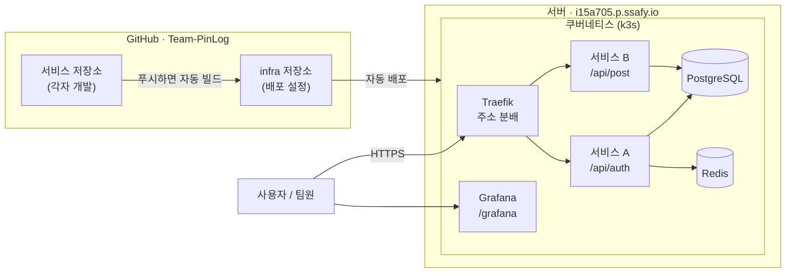

# 온보딩

PinLog 팀에 합류했다면 이 문서부터 읽으세요. 5분이면 됩니다.

---

## 1. 우리 인프라는 이렇게 생겼습니다



**핵심만 말하면:**

- 서버 **한 대**에 쿠버네티스(k3s)가 돌고, 그 위에 서비스들이 뜹니다
- 각자 저장소에 `main` 푸시하면 **약 3분 뒤 자동 배포**됩니다
- 배포 설정은 `infra` 저장소가 관리합니다. 직접 서버에 접속할 일은 거의 없습니다
- **서비스는 주소의 경로로 구분됩니다** (`/api/auth`, `/api/post` …)

---

## 2. 주소 모음

| 용도 | 주소 |
|---|---|
| 서비스 (API) | `https://i15a705.p.ssafy.io/api/<서비스명>/...` |
| **Grafana** (로그·지표) | https://i15a705.p.ssafy.io/grafana |
| GitHub 조직 | https://github.com/Team-PinLog |
| 인프라 저장소 | https://github.com/Team-PinLog/infra |

Grafana 계정은 인프라 담당자에게 문의하세요.

> ArgoCD(배포 도구)와 쿠버네티스는 외부에 열려 있지 않습니다.
> 배포 상태가 궁금하면 인프라 담당자에게 물어보세요.

---

## 3. 역할별로 읽을 문서

### 백엔드 개발자 → **[backend-conventions.md](backend-conventions.md)** (필독)

컨트롤러 작성 **전에** 봐야 합니다. 나중에 바꾸면 리다이렉트·Swagger·OAuth가 깨집니다.

특히 이 세 가지:
1. `context-path`를 `/api/<서비스명>`으로 설정
2. Dockerfile에 `USER 1000` 필수
3. actuator 의존성 필수 (없으면 배포 안 됨)

### 프론트엔드 개발자

API 주소는 `https://i15a705.p.ssafy.io/api/<서비스명>/...` 입니다.
같은 도메인이라 **CORS 설정이 필요 없습니다.**

정적 파일 배포 방식은 아직 정하지 않았습니다. 인프라 담당자와 상의하세요.

### 모두

- **[monitoring.md](monitoring.md)** — 내 서비스 로그·지표 보는 법
- 문제가 생겼을 때: 아래 §6

### 인프라에 관심 있다면

- **[architecture.md](architecture.md)** — 구조와 왜 그렇게 만들었는지
- **[runbook.md](runbook.md)** — 장애 대응
- **[../examples/README.md](../examples/README.md)** — 새 서비스 추가 절차

---

## 4. 개발부터 배포까지

```
1. 코드 작성
2. main 브랜치에 푸시
3. GitHub Actions가 자동으로 빌드 → 이미지 생성
4. 배포 설정(infra)이 자동 갱신됨
5. ArgoCD가 감지해서 서버에 반영  ← 여기까지 약 3분
6. https://i15a705.p.ssafy.io/api/<서비스명> 에서 확인
```

**서버에 SSH로 접속하거나 직접 배포하지 않습니다.** git이 전부입니다.

되돌리고 싶으면 인프라 담당자에게 말씀하세요. `git revert`로 이전 버전으로 돌아갑니다.

---

## 5. 새 서비스를 만들 때

1. `Team-PinLog` 조직에 저장소 생성 (**Public** 권장)
2. **[../examples/hello-service/](../examples/hello-service/)** 를 복사해서 시작
   — 빌드·실행까지 검증된 참조 구현입니다
3. **[backend-conventions.md](backend-conventions.md)** 의 체크리스트 확인
4. **인프라 담당자에게 알리기** ← 배포 설정 추가가 필요합니다

혼자 처음부터 만들기보다 `examples/hello-service` 복사가 훨씬 빠르고 실수가 적습니다.

---

## 6. 문제가 생기면

### 먼저 스스로 확인할 것

**Grafana에서 로그 보기** → Explore → 데이터소스 **Loki** 선택:

```logql
{namespace="pinlog-prod", app="내서비스명"}
```

에러만 보려면:
```logql
{namespace="pinlog-prod", app="내서비스명"} |= "ERROR"
```

### 증상별 원인

| 증상 | 대개 이 문제입니다 |
|---|---|
| **404** | `context-path`와 컨트롤러 경로가 중복됨 |
| **503** | 헬스체크 경로 불일치 (actuator가 context-path 아래로 이동) |
| 배포했는데 반영 안 됨 | 아직 3분 안 지났거나 빌드 실패 — Actions 탭 확인 |
| 파드가 안 뜸 | Dockerfile에 `USER 1000` 누락 |

### 그래도 안 되면

인프라 담당자에게 **서비스명 + 증상 + 시도한 것**을 알려주세요.

---

## 7. 처음 할 일 체크리스트

- [ ] `Team-PinLog` 조직에 초대받았다
- [ ] 이 문서를 읽었다
- [ ] 내 역할에 맞는 문서를 읽었다 (백엔드라면 `backend-conventions.md`)
- [ ] Grafana에 접속해봤다
- [ ] 내 서비스 저장소를 만들고 인프라 담당자에게 알렸다

---

## 알아두면 좋은 것

- **서버는 한 대이고 메모리를 함께 씁니다.** 무거운 빌드를 서버에서 돌리지 마세요.
  빌드는 GitHub Actions에서 합니다
- **Redis는 재시작하면 비워집니다.** 캐시·세션 전용입니다.
  잃으면 안 되는 데이터를 넣어야 하면 미리 말씀해주세요
- **비밀번호·API 키를 코드에 넣지 마세요.** `infra` 저장소는 공개되어 있습니다.
  필요하면 인프라 담당자가 암호화해서 넣어드립니다
- 이 서버는 SSAFY가 제공한 것이라 Gerrit 등 기본 설치된 것들이 있습니다.
  **우리가 쓰는 건 GitHub입니다** — Gerrit에 코드를 올리지 마세요
